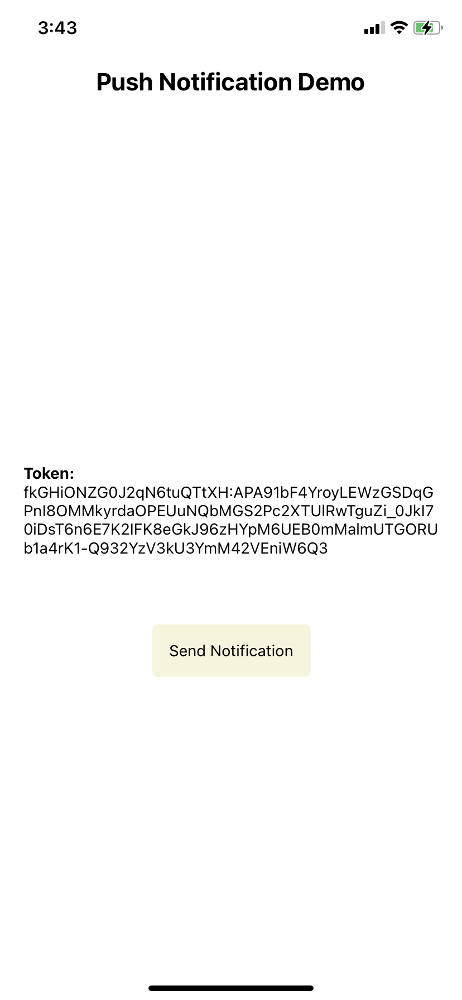
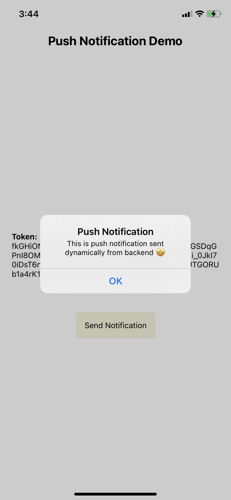

# React Native Demo App

This is a demo react native application for implementing push notifications (remote) using firebase.

### Prerequisites

- Firebase project
- Apple developer account (if setting up for iOS)

### Steps to run the application locally

- Run `npm install` in the root directory to install all the dependencies.
- Run `npx pod-install` to install all the cocoa pods for iOS.
- Add the google-services.json file from firebase project to android/app directory and GoogleService-Info.plist file in ios. Refer to the [blog](https://www.antstack.io/) for setup steps.
- Run `npm run android` for running in android emulator. You'll have to build the app using XCode and run on real apple device for testing on iOS.
- Update the send notifications endpoint if you want to test with your own backend.
- Refer to [push-notification-lambda](https://github.com/antstackio/push-notification-lambda) repository for demo backend application.

### Screenshots

   &nbsp; &nbsp;
   &nbsp;&nbsp;
   &nbsp;&nbsp;

